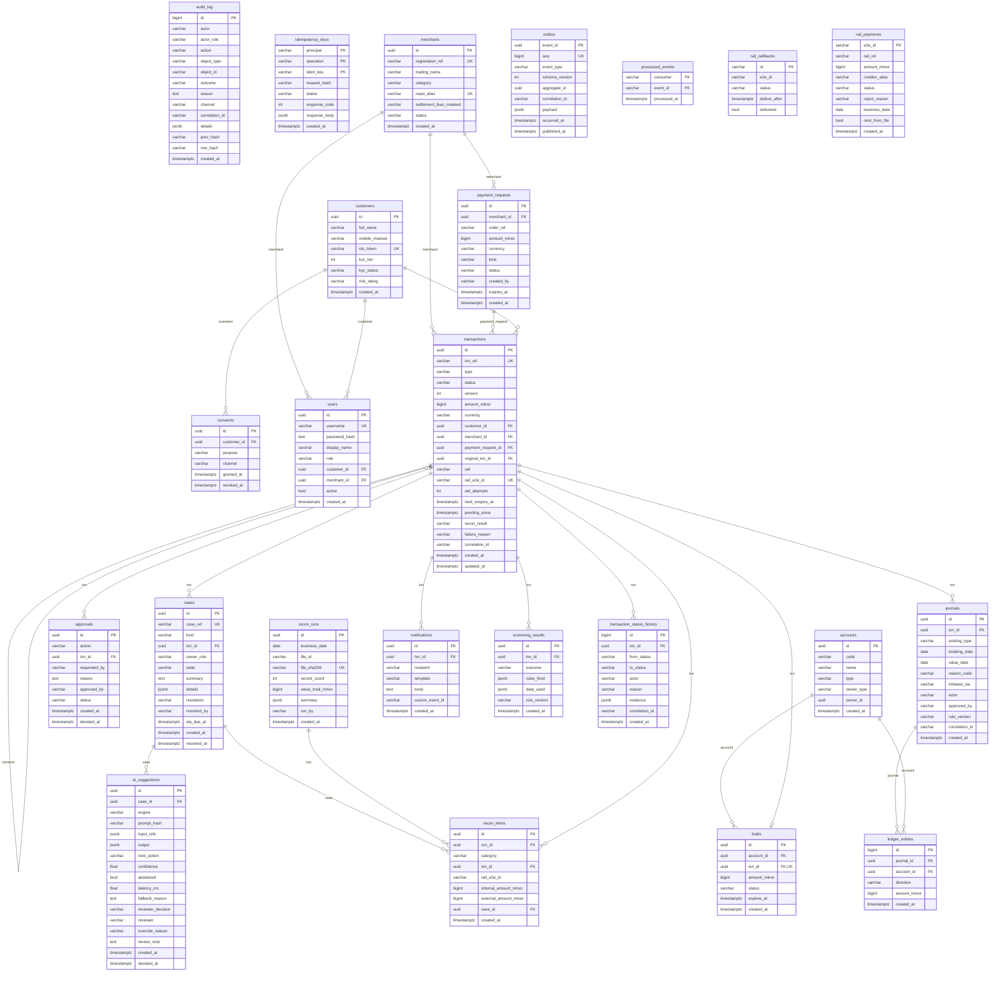

# Full ERD (generated from `src/paya/models.py`)

```mermaid
erDiagram
  accounts {
    uuid id PK
    varchar code
    varchar name
    varchar type
    varchar owner_type
    uuid owner_id
    timestamptz created_at
  }
  audit_log {
    bigint id PK
    varchar actor
    varchar actor_role
    varchar action
    varchar object_type
    varchar object_id
    varchar outcome
    text reason
    varchar channel
    varchar correlation_id
    jsonb details
    varchar prev_hash
    varchar row_hash
    timestamptz created_at
  }
  customers {
    uuid id PK
    varchar full_name
    varchar mobile_masked
    varchar idv_token UK
    int kyc_tier
    varchar kyc_status
    varchar risk_rating
    timestamptz created_at
  }
  idempotency_keys {
    varchar principal PK
    varchar operation PK
    varchar idem_key PK
    varchar request_hash
    varchar status
    int response_code
    jsonb response_body
    timestamptz created_at
  }
  merchants {
    uuid id PK
    varchar registration_ref UK
    varchar trading_name
    varchar category
    varchar raast_alias UK
    varchar settlement_iban_masked
    varchar status
    timestamptz created_at
  }
  outbox {
    uuid event_id PK
    bigint seq UK
    varchar event_type
    int schema_version
    uuid aggregate_id
    varchar correlation_id
    jsonb payload
    timestamptz occurred_at
    timestamptz published_at
  }
  processed_events {
    varchar consumer PK
    varchar event_id PK
    timestamptz processed_at
  }
  recon_runs {
    uuid id PK
    date business_date
    varchar file_id
    varchar file_sha256 UK
    int record_count
    bigint value_total_minor
    jsonb summary
    varchar run_by
    timestamptz created_at
  }
  consents {
    uuid id PK
    uuid customer_id FK
    varchar purpose
    varchar channel
    timestamptz granted_at
    timestamptz revoked_at
  }
  payment_requests {
    uuid id PK
    uuid merchant_id FK
    varchar order_ref
    bigint amount_minor
    varchar currency
    varchar kind
    varchar status
    varchar created_by
    timestamptz expires_at
    timestamptz created_at
  }
  users {
    uuid id PK
    varchar username UK
    text password_hash
    varchar display_name
    varchar role
    uuid customer_id FK
    uuid merchant_id FK
    bool active
    timestamptz created_at
  }
  transactions {
    uuid id PK
    varchar txn_ref UK
    varchar type
    varchar status
    int version
    bigint amount_minor
    varchar currency
    uuid customer_id FK
    uuid merchant_id FK
    uuid payment_request_id FK
    uuid original_txn_id FK
    varchar rail
    varchar rail_e2e_id UK
    int rail_attempts
    timestamptz next_enquiry_at
    timestamptz pending_since
    varchar recon_result
    varchar failure_reason
    varchar correlation_id
    timestamptz created_at
    timestamptz updated_at
  }
  approvals {
    uuid id PK
    varchar action
    uuid txn_id FK
    varchar requested_by
    text reason
    varchar approved_by
    varchar status
    timestamptz created_at
    timestamptz decided_at
  }
  cases {
    uuid id PK
    varchar case_ref UK
    varchar kind
    uuid txn_id FK
    varchar owner_role
    varchar state
    text summary
    jsonb details
    varchar resolution
    varchar resolved_by
    timestamptz sla_due_at
    timestamptz created_at
    timestamptz resolved_at
  }
  holds {
    uuid id PK
    uuid account_id FK
    uuid txn_id FK,UK
    bigint amount_minor
    varchar status
    timestamptz expires_at
    timestamptz created_at
  }
  journals {
    uuid id PK
    uuid txn_id FK
    varchar posting_type
    date booking_date
    date value_date
    varchar reason_code
    varchar initiated_via
    varchar actor
    varchar approved_by
    varchar rule_version
    varchar correlation_id
    timestamptz created_at
  }
  notifications {
    uuid id PK
    uuid txn_id FK
    varchar recipient
    varchar template
    text body
    varchar source_event_id
    timestamptz created_at
  }
  screening_results {
    uuid id PK
    uuid txn_id FK
    varchar outcome
    jsonb rules_fired
    jsonb data_used
    varchar rule_version
    timestamptz created_at
  }
  transaction_status_history {
    bigint id PK
    uuid txn_id FK
    varchar from_status
    varchar to_status
    varchar actor
    varchar reason
    jsonb evidence
    varchar correlation_id
    timestamptz created_at
  }
  ai_suggestions {
    uuid id PK
    uuid case_id FK
    varchar engine
    varchar prompt_hash
    jsonb input_refs
    jsonb output
    varchar next_action
    float confidence
    bool abstained
    float latency_ms
    text fallback_reason
    varchar reviewer_decision
    varchar reviewer
    varchar override_reason
    text review_note
    timestamptz created_at
    timestamptz decided_at
  }
  ledger_entries {
    bigint id PK
    uuid journal_id FK
    uuid account_id FK
    varchar direction
    bigint amount_minor
    timestamptz created_at
  }
  recon_items {
    uuid id PK
    uuid run_id FK
    varchar category
    uuid txn_id FK
    varchar rail_e2e_id
    bigint internal_amount_minor
    bigint external_amount_minor
    uuid case_id FK
    timestamptz created_at
  }
  rail_callbacks {
    varchar id PK
    varchar e2e_id
    varchar status
    timestamptz deliver_after
    bool delivered
  }
  rail_payments {
    varchar e2e_id PK
    varchar rail_ref
    bigint amount_minor
    varchar creditor_alias
    varchar status
    varchar reject_reason
    date business_date
    bool omit_from_file
    timestamptz created_at
  }
  customers ||--o{ consents : "customer"
  merchants ||--o{ payment_requests : "merchant"
  merchants ||--o{ users : "merchant"
  customers ||--o{ users : "customer"
  merchants ||--o{ transactions : "merchant"
  payment_requests ||--o{ transactions : "payment_request"
  transactions ||--o{ transactions : "corrects"
  customers ||--o{ transactions : "customer"
  transactions ||--o{ approvals : "txn"
  transactions ||--o{ cases : "txn"
  accounts ||--o{ holds : "account"
  transactions ||--o| holds : "txn"
  transactions ||--o{ journals : "txn"
  transactions ||--o{ notifications : "txn"
  transactions ||--o{ screening_results : "txn"
  transactions ||--o{ transaction_status_history : "txn"
  cases ||--o{ ai_suggestions : "case"
  journals ||--o{ ledger_entries : "journal"
  accounts ||--o{ ledger_entries : "account"
  cases ||--o{ recon_items : "case"
  recon_runs ||--o{ recon_items : "run"
  transactions ||--o{ recon_items : "txn"
```
